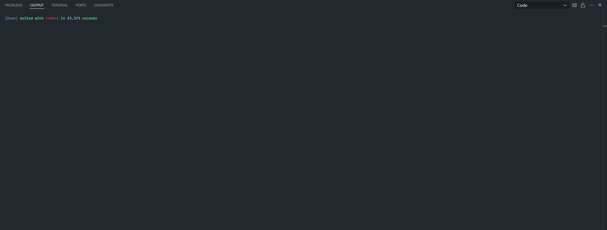

# Google Image Scraper

This Python script automates the process of fetching image URLs for a list of keywords using Selenium and Google Images. It reads keywords from a text file, performs a Google Image search for each keyword, and retrieves the URL of the first image result. The results are saved in a CSV file for easy access.

## Features

- Reads a list of keywords from a text file.
- Fetches image URLs from Google Image search results.
- Saves the keyword and corresponding image URL in a CSV file (semicolon-delimited).
- Includes error handling and retry mechanisms for robust performance.
- Utilizes Selenium WebDriver with headless Chrome for automation.

## Prerequisites

- Python 3.x
- Selenium
- Google Chrome installed
- ChromeDriver matching your Chrome version

## Setup

1. Install the required Python packages:
   ```bash
   pip install selenium
   ```
2. Update the script with the correct path to your `chromedriver.exe`:
   ```python
   service = Service('path/to/your/chromedriver.exe')
   ```
3. Place your keywords in a text file (`source/image_source.txt`), one keyword per line.
4. Specify the output file path (`output/image_urls.csv`).

## Usage

1. Run the script:
   ```bash
   python image_scraper.py
   ```
2. The script will fetch the first image URL for each keyword and save the results in the CSV file.

## Notes

- Ensure your `chromedriver.exe` is compatible with the installed Chrome version.
- Use the headless mode for running the script in the background.
- Google may block excessive automated requests. Use this script responsibly.

## Example Output

Input file (`source/image_source.txt`):

```
cat
dog
mountain
```

Output file (`output/image_urls.csv`):

```
Keyword;Image URL
cat;https://example.com/cat-image.jpg
dog;https://example.com/dog-image.jpg
mountain;Not found
```

Robot Execution:


Robot Execiton UI:


---

Let me know if you'd like further customization or additional sections!
